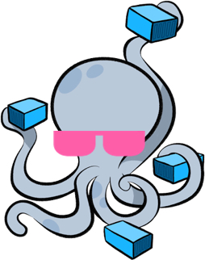

<h1 align="center">
  <br>
  <br>
  awesome-compose
  <br>
</h1>

<h4 align="center">My own curated list of Docker Compose samples.</h4>

<p align="center">
  <a href="https://awesome.re"></a>
  <a href="LICENSE"></a>
</p>

<p align="center">
  <a href="#samples">Samples</a> •
  <a href="#getting-started">Getting Started</a>
</p>


## Samples

### Basic setups

- [`Prometheus / Blackbox Exporter`](prometheus-blackbox) - Sample Prometheus with Blackbox Exporter and a few targets to probe

## Getting started

These instructions will get you through the bootstrap phase of creating and
deploying samples of containerized applications with Docker Compose.

### Prerequisites

- Make sure that you have Docker and Docker Compose installed
  - Windows or macOS:
    [Install Docker Desktop](https://www.docker.com/get-started)
  - Linux: [Install Docker](https://www.docker.com/get-started) and then
    [Docker Compose](https://github.com/docker/compose)
- Download some or all of the samples from this repository.

### Running a sample

The root directory of each sample contains the `compose.yaml` which
describes the configuration of service components. All samples can be run in
a local environment by going into the root directory of each one and executing:

```console
docker compose up -d
```

Check the `README.md` of each sample to get more details on the structure and
what is the expected output.
To stop and remove all containers of the sample application run:

```console
docker compose down
```
